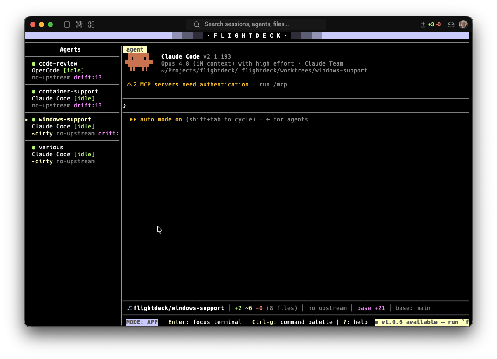

# FlightDeck

**FlightDeck** is a macOS, Linux, and Windows terminal UI for orchestrating multiple
local AI coding agents working in parallel on the same Git project. You run it
from inside a Git repository; it creates isolated Git **worktrees** under
`.flightdeck/`, launches a selected AI coding agent inside each one, lets you
switch between parallel agent sessions, open extra child shells in each worktree,
tracks Git and agent status, and helps push branches for GitHub pull-request
workflows.

> Each Agent Tab = 1 Worktree = 1 Branch = 1 Primary Agent Process + Optional Shell Processes



## Quick start

Install with Homebrew:

```bash
brew install neworange-ruud/tap/flightdeck
```

Or install on macOS or Linux directly from the latest GitHub Release:

```bash
curl --proto '=https' --tlsv1.2 -LsSf https://github.com/neworange-ruud/flightdeck/releases/latest/download/flightdeck-installer.sh | sh
```

On Windows, install from the same release with PowerShell:

```powershell
irm https://github.com/neworange-ruud/flightdeck/releases/latest/download/flightdeck-installer.ps1 | iex
```

Update direct (installer) installs in place with:

```bash
flightdeck update
```

This checks the latest GitHub Release and replaces the binary if a newer version
exists. It only self-updates installs done via the installer above; for Homebrew
installs it defers to the package manager — update those with:

```bash
brew update && brew upgrade flightdeck
```

The Windows build is pure-Rust and ships **without** the self-updater
(`flightdeck update` is a no-op there); upgrade by re-running the PowerShell
installer above, which fetches the latest release.

### Update Notice

FlightDeck tells you when a newer release is out. It's **on by default** and
checks GitHub Releases at most **once a day** in the background (cached per-user,
never blocking startup). Ensure it is enabled with:

```bash
flightdeck setup-update          # sets update.check = true in config.toml
```

When a newer version is available, FlightDeck shows a status-bar hint. It only
informs — it never auto-updates; you still run `flightdeck update` (or
`brew update && brew upgrade flightdeck`) yourself. Disable any time by setting
`check = false` under `[update]`.

```bash
cd /path/to/your/git/repo
flightdeck
```

On first run FlightDeck auto-initializes (no `flightdeck init` needed):

```text
your-repo/
  .flightdeck/
    config.toml        # committed, human-editable
    state.json         # ignored (runtime state)
    worktrees/         # ignored (managed worktrees)
```

It also appends two entries to your `.gitignore` (append-only — existing content
is preserved):

```gitignore
.flightdeck/state.json
.flightdeck/worktrees/
.flightdeck/agent-status
.flightdeck/runtime/
```

Configured agents live in the config (OpenCode is the default; Claude Code and
Codex CLI are pre-configured). Agent definitions are config-driven — edit the
`command` and `args` there. When you create a tab you pick which agent it runs
from a quick menu, so you can mix agents (e.g. Claude Code in one tab, OpenCode
in another); the menu is skipped when only one agent is configured.

## Configuration

FlightDeck layers two config files into one effective config:

```text
~/.flightdeck/config.toml       # per-user GLOBAL base (all settings, documented)
<repo>/.flightdeck/config.toml  # per-project OVERRIDE (only changed values)
```

The **global** file is created on first run with every setting present and
commented, so it's clear what you can override. Each **project** only stores the
values it changes — everything else is inherited from the global base. The
project layer wins field-by-field, except `[agents]`, which a project replaces
wholesale when it defines any of its own. (Existing fully-populated project
configs keep working unchanged.)

Open the **configuration manager** from the command palette
("Open Configuration") to edit the common settings without leaving FlightDeck:

- `↑`/`↓` move, `Space` toggles a setting or cycles a choice.
- `Tab` switches between **Global** and **Project** scope — the header always
  shows which file you're editing (and which project).
- `c` clears a project override so the value re-inherits from the global base.
- `s` saves (and reloads every open project's config); `e` opens the raw
  `config.toml` in `$EDITOR` for the full surface (containers, agents, git, …).

## Running agents in containers (optional)

FlightDeck can run each agent inside an isolated, rootless **Podman** container
instead of directly on the host. The agent's git worktree is bind-mounted at
`/workspace`, so the host keeps owning the worktree and all git operations while
the agent process is sandboxed. It's a **project-wide toggle** — when enabled,
all agents run in containers; new tabs `podman run`, child shells (`Ctrl-t`)
`podman exec` into the same container, and a still-running container is
reattached across FlightDeck restarts.

Enable it in `.flightdeck/config.toml`, then build the image and check readiness:

```toml
[containers]
enabled = true
runtime = "podman"
# forward_ports = [3000]        # publish dev-server ports to 127.0.0.1 only
```

```bash
flightdeck image build claude   # builds a self-contained image, installs the agent CLI
flightdeck doctor               # verifies podman + images are ready
```

Every launch is checked by non-disableable guardrails: no `--privileged`, no
docker/podman socket mount, no `--env-host`, no home-directory mount, and ports
publish to `127.0.0.1` only. Containers run with `--cap-drop all` and
`--security-opt no-new-privileges`. Network egress is unrestricted in v1 (full
outbound). See `containers/README.md` for the full configuration (resource
limits, credential mounts, custom base images / Containerfiles).

## The Git ownership boundary (why FlightDeck is safe)

FlightDeck deliberately **never mutates commit history**. This boundary is
enforced *by construction*: the `GitExecutor` trait does not even expose a
history-rewriting operation, and a guard test (`tests/guards.rs`) fails the build
if a forbidden git subcommand ever appears in the source.

FlightDeck **may**: detect the repo root / base branch / dirty state, create
`.flightdeck/`, update `.gitignore` (append-only), create & attach branches,
create & recover worktrees, push branches *after explicit confirmation*, remove
managed worktrees (a clean worktree is removed immediately; a worktree with
uncommitted changes is removed only after you confirm discarding them), perform
a guarded local merge-back only when strict preconditions hold, rebase an agent
worktree onto its base branch under explicit confirmation, and **pull base**
(`git pull --rebase` on the base folder) to update the local base branch after a
PR merges.

FlightDeck **must not** (and cannot): stage files, create/amend/squash commits,
rebase automatically, rewrite history, force-push, create GitHub PRs, or
auto-resolve merge conflicts. You (or your agent) make the commits; FlightDeck shows you a GitHub PR
**compare URL** after a push so you create the PR yourself.

## Keyboard model

FlightDeck is keyboard-first with two modes. The **command palette** (`Ctrl-g`)
is the dependable fallback because terminal shortcut collisions are unavoidable.

- **Terminal mode** — keystrokes go to the active terminal. `F2` leaves to
  app mode; `Ctrl-g` opens the palette. Bare `Esc` passes through to the
  terminal so hosted agents can use their own Esc gestures.
- **App mode** — keystrokes control FlightDeck. `Enter` focuses the terminal;
  `?` shows help.

Common shortcuts: `Ctrl-g` palette · `Ctrl-q` quit (or palette → *Quit*) ·
`Shift-←/→` previous/next **project** · `Ctrl-n` new tab · `Ctrl-p` push ·
`Ctrl-u` pull base · `Ctrl-f`
finish/local-merge · `Ctrl-k` close tab · `Alt-↑/↓` previous/next **agent tab**
· `Alt-1..9` jump to agent tab ·
`Ctrl-t` new child terminal · `Ctrl-w` close child · `Alt-←/→` cycle the
**terminal tabs** (agent + shells) · `Ctrl-s` set manual status · `Ctrl-r`
restart agent. The `Alt`- and `Shift`-modified navigation works in **both**
modes, so you can switch projects and tabs without leaving terminal focus; in
App mode the bare arrow keys also work (handy because some terminals intercept
`Alt`+arrows). The full table is in the in-app help (`?`).

**Multiple projects**: the **project tab row** at the top switches between open
project folders. Open another with the **`+ project`** button (or palette →
*Open Project*) — type a path or browse folders. Every open project stays live
in the background (its agents keep running and still notify), and open projects
are remembered across restarts. See [Multiple projects](#multiple-projects).

**Mouse**: click a **project tab** at the top to switch projects (or its `✕` to
close it, `+ project` to open one); click an Agent Tab in the sidebar to select
it (or click anywhere else in the sidebar to switch to App mode without changing
the selection), or a child-terminal tab (`agent | shell 1 | …`) to switch
terminals.

## Screen layout

```text
┌──────────────────────────────────────────────────────────────────────────┐
│ ░░░▒▒▒▓▓▓██████   F · L · I · G · H · T · D · E · C · K   ██████▓▓▓▒▒▒░░░ │  logo header
│ ● flightdeck ✕ | ● api ✕ | ● web ✕                              + project │  project tabs
├──────────────────────────────────────────────────────────────────────────┤  divider
│ Agents          │ agent | shell 1 | shell 2                                │  terminal tabs
│  ▸ fix-login    │                                                          │
│    add-tests    │            active terminal (agent or shell)              │
│                 │                                                          │
│                 ├──────────────────────────────────────────────────────────┤
│                 │ ⎇ flightdeck/fix-login │ +3 ~2 -1 (6 files) │ ↑0 ↓0 │ …  │  git info bar
│                 ├──────────────────────────────────────────────────────────┤
│                 │ MODE: TERMINAL | F2: app commands | Ctrl-g: palette      │  status bar
└─────────────────┴──────────────────────────────────────────────────────────┘
```

- **Logo header + divider** — a full-width branded title row. The logo centers
  itself and shrinks to a tighter variant on narrow terminals.
- **Project tabs** — one tab per open project (its folder name) with a status
  dot (red = needs attention, cyan = an agent is working, dim = idle) and a `✕`
  to close it; the active project is highlighted. `+ project` opens another.
  See [Multiple projects](#multiple-projects).
- **Agents sidebar** — the list of Agent Tabs (each shows agent, process/status,
  and git indicators), under a centered **Agents** heading.
- **Git info bar** — a one-line summary for the selected tab's worktree: branch,
  changed-file counts (`+added ~modified -deleted (N files)`, or `clean`),
  ahead/behind vs upstream (or `no upstream` until the branch is pushed), base
  drift, and the base branch. It reflects the tab's worktree regardless of
  whether the agent or a shell is focused.

## Multiple projects

FlightDeck can run several project folders at once. The folder you launch from
is the first project; the **project tab row** at the top switches between them.

- **Open a project** — click **`+ project`** on the tab row, or run the
  **Open Project** command from the palette (`Ctrl-g`). The picker lets you
  **type a folder path** or **browse**: `↑`/`↓` select a subfolder, `→` (or
  `Tab`) opens it, `←` goes to the parent, `Enter` opens the highlighted folder
  (or the typed path) as a project. It must be a Git repository.
- **Switch projects** — `Shift+←` / `Shift+→` (works in both modes, so it does
  not require leaving terminal focus), click a project tab, or use the
  **Next/Previous Project** palette commands.
- **Close a project** — click a project tab's `✕`, or run **Close Project**.
  Closing is confirmed first and **stops that project's agents**; you can't close
  the only remaining project (use `Ctrl-q` to quit).
- **Everything runs in parallel.** Every open project stays live in the
  background — its agents keep running and still fire OS notifications when they
  finish or need input, even while you're looking at another project. Each
  project keeps its own Agent Session Tabs, worktrees, git status, and base
  branch.
- **Remembered across restarts.** The set of open projects is saved to
  `~/.flightdeck/workspace.json`; relaunching reopens the same project tabs.
  Each project's own tabs are still recovered from its `state.json`, and agents
  are **never auto-relaunched** (restart one with `Ctrl-r`).

## Agent status indicators

Every Agent Tab shows its agent's live status — a one-cell indicator next to the
tab name plus a simplified status line in the sidebar. The same indicator is
summarized on Project tabs. The minimum signal is **idle vs in progress**, and
it works for every built-in backend (OpenCode, Claude Code, Codex CLI) through
automatically injected integrations:

- 🔴 **working** — a red animated Braille spinner while the backend reports an active turn.
- 🟢 **idle** — a green dot while the backend waits for a prompt.
- 🔵 manual override (`Ctrl-s`) — shown in cyan, never hides the process state.

FlightDeck injects a launch-scoped lifecycle bridge for each built-in backend:
Claude Code prompt/stop hooks, Codex prompt/stop hooks, and OpenCode's explicit
`session.status` events. Generated bridge files live below the ignored
`.flightdeck/runtime/` directory. Terminal output is never used as activity, so
typing into a prompt cannot mark an agent working or arm a false notification.
Unsupported custom agents stay neutral instead of being guessed from output.

Codex requires non-managed hooks to be reviewed once. If Codex shows a hook
warning, open `/hooks`, review the FlightDeck lifecycle hooks, and trust them;
until then FlightDeck deliberately remains idle and emits no completion alert.

### Optional: reusable global status integrations

The automatic launch integration is normally sufficient. To generate equivalent
hooks/plugins for sessions launched outside FlightDeck, run:

```bash
flightdeck setup-status
```

This writes ready-to-use, self-contained hook/plugin artifacts to
`.flightdeck/integrations/` and adds `.flightdeck/agent-status` to `.gitignore`.
Each integration writes lifecycle events (`working`/`idle`/`waiting`) to
`<worktree>/.flightdeck/agent-status`. The hooks are gated on `.flightdeck/`
existing, so they're a no-op outside FlightDeck worktrees. Wire them per the
generated `README.md`:

- **Claude Code** — merge `claude-code.settings.json` into `~/.claude/settings.json`
  (`UserPromptSubmit`→working, `Stop`/`StopFailure`→idle, permission/input
  notifications→waiting).
- **Codex CLI** — append `codex-config.toml` to `~/.codex/config.toml`
  (`UserPromptSubmit`→working, `Stop`→idle; `notify` fallback for older builds).
- **OpenCode** — copy `opencode-flightdeck.js` to `~/.config/opencode/plugin/`
  (`session.status` busy/idle→working/idle, permission and question prompts→waiting).

### OS notifications (macOS and Linux)

FlightDeck posts a native OS notification when an agent finishes a running task,
so you get pinged the moment a background tab is done while your attention is
elsewhere. A notification fires on the **edge** from an active state
(working/starting) to a settled one:

- **finished** — the agent went idle / completed its turn,
- **waiting** — the agent is waiting for input / needs attention,
- **failed** — the agent errored out.

It fires once per transition (a quiet agent never re-notifies until it resumes
work) and is suppressed briefly at startup so resumed agents settling to idle
don't produce a burst. Only explicit lifecycle transitions can arm an alert. The
notification title is prefixed with the project name (`myproject: my-agent`), so
alerts stay unambiguous when several projects are open.

Notifications are **on by default**. The master switch is `enabled`; the three
per-category toggles and the alert sounds (`sound`) also default to `true`:

```toml
[notifications]
enabled = true     # master switch (on by default)
on_finish = true   # agent went idle / completed
on_waiting = true  # agent is waiting for input / needs attention
on_failed = true   # agent errored out
sound = true       # play distinct sounds for completion and input-required alerts
```

Turn them off from the configuration manager (see [Configuration](#configuration))
or by setting `enabled = false` under `[notifications]` in the global or a
project config. `flightdeck setup-notifications` re-enables them for a project
that turned them off.

Delivery on macOS: if [`terminal-notifier`](https://github.com/julienXX/terminal-notifier)
is installed (`brew install terminal-notifier`) FlightDeck uses it — the most
reliable option, since it registers as a real app and prompts for permission on
first use. Otherwise it falls back to `osascript`, whose notifications are
attributed to **Script Editor**: enable **System Settings → Notifications →
Script Editor** (and make sure no Focus / Do Not Disturb is active) or banners
are silently dropped.

Delivery on Linux: FlightDeck posts via `notify-send` (libnotify). On
Debian/Ubuntu install it with `sudo apt install libnotify-bin`. If `notify-send`
is not on `PATH`, notifications are silently dropped. Windows is a no-op.

## Architecture

Business logic is separated from the TUI and fully testable. Git, the
filesystem, and PTYs sit behind traits (`src/contracts/traits.rs`) so every logic
module is unit-tested against fakes (`src/testing/`). The TUI dispatches
`Command`s into the headless app core, which calls services — the TUI never runs
git/fs/pty itself.

```text
src/
  contracts/   shared types, traits, errors, trivial real impls
  testing/     FakeGit / FakeFs / FakePty / FakeClock
  config/      load/serialize config.toml, defaults, first-run init
  fs/          relative/absolute paths, append-only .gitignore updater
  git/         real GitExecutor + branch/worktree/status/remote workflow logic
  agents/      registry, PATH validation, lifecycle-status integrations
  persistence/ state.json load/save + worktree recovery
  terminal/    portable-pty backend + session model (primary + child shells)
  app/         headless state, commands, dispatch, input modes
  tui/         ratatui layout, render, key mapping, command palette
  lib.rs       run(): startup → recovery → event loop → clean teardown
tests/
  integration/ real temp-git-repo workflow tests
  guards.rs    SPECS §2 (naming) and §5 (no history rewriting) guards
```

## Development

Requires a Rust toolchain (stable) and `git`.

```bash
cargo build                              # debug build
cargo build --release                    # release build
cargo test                               # unit + integration + guard tests
cargo clippy --all-targets -- -D warnings
cargo fmt --check
cargo run                                # run inside a git repo
```

### Cross-building for Windows

The app compiles and runs on Windows. You can build a Windows `.exe` from
macOS/Linux without a Windows machine — cross-compilation is
CPU-architecture-independent, so it works on Apple Silicon too:

```bash
scripts/build-windows                    # release .exe via cargo-xwin in Docker
scripts/build-windows debug              # debug build
```

This uses [`cargo-xwin`](https://github.com/rust-cross/cargo-xwin) in Docker to
download the MSVC CRT/SDK import libraries and link with LLVM `lld` — no MSVC
install required. The binary lands at
`target/x86_64-pc-windows-msvc/release/flightdeck.exe`. The container ships the
clang-based C cross-toolchain the dependency graph needs (the self-update path
pulls in `aws-lc-sys`, a C crypto library), so a bare `cargo check --target
x86_64-pc-windows-msvc` on the host is **not** sufficient — use the script (or
CI) for any Windows compile check.

Building is one thing; **running** a Windows binary needs Windows. The
`windows-latest` CI job (see `.github/workflows/ci.yml`) compiles, lints, and
runs the test suite on real Windows on every push — that is the canonical check.
To exercise the TUI interactively on an Apple Silicon Mac, use a Windows 11 on
ARM VM (its built-in x64 emulation runs the x86_64 binary); Wine's console
emulation is not reliable for a full-screen PTY app.

## Release

Releases are built by `cargo-dist` in GitHub Actions when a version tag is
pushed. To publish a release, install `dist` once if needed:

```bash
cargo install cargo-dist --version 0.32.0 --locked
```

Then run one command from a clean working tree:

```bash
./scripts/release 0.2.0
```

The script moves the current `## [Unreleased]` notes into a new versioned
`CHANGELOG.md` entry dated for the release, resets `Unreleased` back to the
empty template, updates `Cargo.toml`, refreshes `Cargo.lock`, runs formatting,
Clippy, tests, validates the cargo-dist plan, commits `Release v0.2.0`, tags it,
and pushes the branch and tag. GitHub Actions then creates the GitHub Release,
uploads the installer/artifacts/checksums, and publishes the Homebrew formula to
`neworange-ruud/homebrew-tap`.

Repository setup required for Homebrew publishing:

- Create the `neworange-ruud/homebrew-tap` repo if it does not exist.
- Add a `HOMEBREW_TAP_TOKEN` repository secret with permission to push to that
  tap.
- Ensure Actions has read/write workflow permissions for release creation.

### macOS code signing

Release binaries are signed in CI with an Apple Developer ID Application
certificate (`macos-sign = true` in `dist-workspace.toml`) and built with the
**hardened runtime** enabled. The hardened runtime is turned on via
`.github/workflows/build-setup.steps`, which exports `CODESIGN_OPTIONS=runtime`
before `dist build` (cargo-dist has no dedicated config key for it). That file
is injected into the build job through the `github-build-setup` key, so
`dist generate --check` stays green — edit `build-setup.steps` rather than
`release.yml` directly, then re-run `dist generate`.

Required repository secrets (a missing one silently disables signing):

- `CODESIGN_CERTIFICATE` — base64-encoded `.p12` (Developer ID Application cert
  plus private key).
- `CODESIGN_CERTIFICATE_PASSWORD` — passphrase for that `.p12`.
- `CODESIGN_IDENTITY` — the identity string, e.g.
  `Developer ID Application: <name> (<TEAMID>)`.

Releases are **signed but not notarized** (cargo-dist 0.32 does not notarize).
This is fine for the Homebrew and `curl | sh` install paths, which do not apply
a Gatekeeper quarantine. Artifacts downloaded through a web browser would be
quarantined and rejected by Gatekeeper until notarized — add a
`notarytool` + `stapler` step if browser distribution is ever needed.

To verify a built binary: `codesign -dv --verbose=4 <path>` should show the
Developer ID authority and `flags=0x10000(runtime)`.

## Manual smoke test (human, requires a real terminal)

Automated tests cannot drive a real attached terminal/PTY end-to-end. After
changes, run this checklist by hand from inside a scratch Git repo:

1. `cargo run` inside a git repo → FlightDeck starts; `.flightdeck/` is created
   and `.gitignore` gains the two entries (notice shown). A branded logo header
   and divider span the top of the screen.
2. **New tab** (`Ctrl-n`) → pick an agent from the menu (e.g. Claude Code) →
   enter a name → the `flightdeck/<slug>` branch + worktree are created and the
   chosen agent launches in the primary terminal.
3. **Missing agent**: edit `config.toml` to a bogus `command`, create a tab →
   creation fails with a clear message and **no** branch/worktree is created.
4. **Child terminal** (`Ctrl-t`) → a shell opens in the same worktree; switch
   with `Alt-←/→` (or click its tab); close with `Ctrl-w`. The agent's and each
   shell's live output renders in the main pane.
5. **Git info bar**: the line above the status bar shows the selected tab's
   branch, change counts, ahead/behind, and base — and stays correct whether the
   agent or a shell tab is focused.
6. **Git status** (palette → *Show Git Status*) → branch, base, drift, dirty,
   ahead/behind, worktree path.
7. **Push** (`Ctrl-p`) → with uncommitted changes you are warned; after a commit,
   confirm push → a GitHub PR compare URL is shown (if origin is GitHub).
8. **Manual status** (`Ctrl-s`) → set/clear; the process state stays visible.
9. **Abandon worktree** (palette → *Abandon Worktree*) → a clean worktree is
   removed at once; with uncommitted changes you are asked to confirm discarding
   them before it is force-removed.
10. **Close tab** (`Ctrl-k`) → the option menu defaults to *Send Ctrl-C to
    primary*; it never auto-escalates to force-kill.
11. **Quit**: `Ctrl-q`, or open the palette (`Ctrl-g`) and choose *Quit* — both
    exit cleanly.
12. **Recovery / resume**: quit (`Ctrl-q`), relaunch → tabs are reconstructed
    from disk and their agents are restarted automatically when their worktree
    still exists (you can also restart any tab manually with `Ctrl-r`).
13. **No orphans**: after quitting, confirm no agent/shell child processes are
    left running (e.g. `pgrep -fl opencode`).

## Status

MVP. Out of scope for now: multiple repos per process, live terminal
resurrection after restart, automatic commits/PRs, GitHub API integration, an
agent plugin system, initial-prompt injection, a diff viewer, split panes, and
multiple base branches (see SPECS §28).
